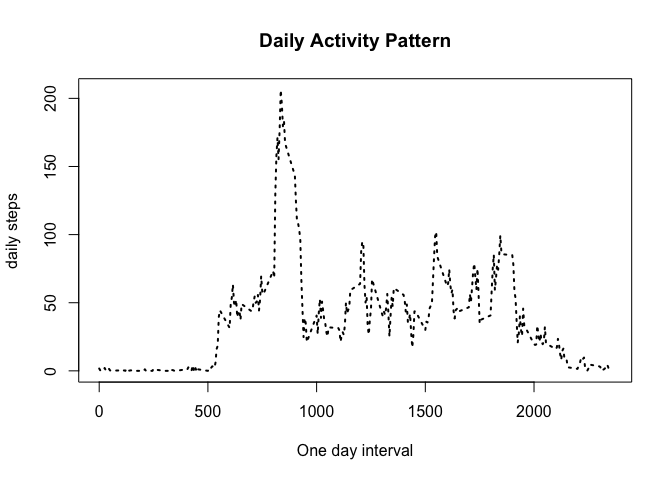
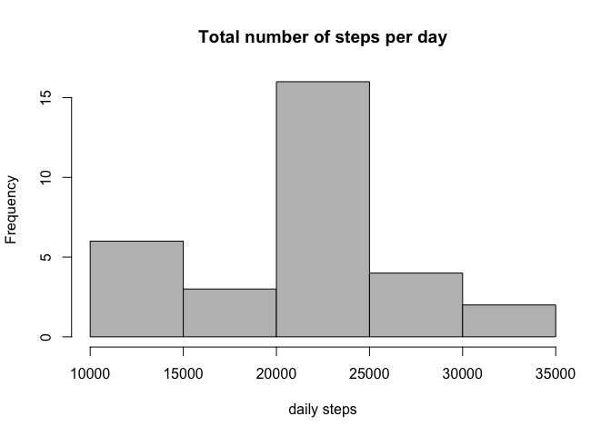
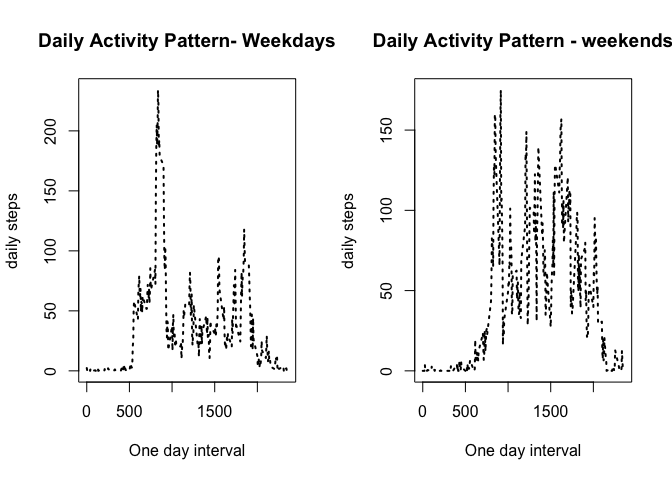

## Loading and preprocessing the data


```r
data<-unzip("activity.zip")  
activity<-read.csv(data,header=T, na.strings = "NA")

activity$date <- as.Date(activity$date)
activity$steps <- as.numeric(activity$steps)
```

## What is mean total number of steps taken per day?

1. Make a histogram of the total number of steps taken each day

```r
library(lubridate)
```

```
## 
## Attaching package: 'lubridate'
```

```
## The following object is masked from 'package:base':
## 
##     date
```

```r
library(dplyr)
```

```
## 
## Attaching package: 'dplyr'
```

```
## The following objects are masked from 'package:lubridate':
## 
##     intersect, setdiff, union
```

```
## The following objects are masked from 'package:stats':
## 
##     filter, lag
```

```
## The following objects are masked from 'package:base':
## 
##     intersect, setdiff, setequal, union
```

```r
activity<- mutate(activity, day = day(activity$date))
stepsum<-aggregate(steps~day,activity, sum)
hist(stepsum$steps, main = "Total number of steps per day", xlab="daily steps", col = "grey")
```

<!-- -->
2. Calculate and report the **mean** and **median** total number of steps taken per day

```r
summary(stepsum$steps)[3:4]
```

```
##   Median     Mean 
## 20597.50 19020.27
```

## What is the average daily activity pattern?

3. Make a time series plot (i.e. `type = "l"`) of the 5-minute interval (x-axis) and the average number of steps taken, averaged across all days (y-axis)

```r
stepsdailypattern<-aggregate(steps~interval,activity, mean)
plot(steps~interval,stepsdailypattern, type ="l", lwd=2, lty=3, main = "Daily Activity Pattern", xlab = "One day interval", ylab = "daily steps")
```

<!-- -->

4. Which 5-minute interval, on average across all the days in the dataset, contains the maximum number of steps?


```r
stepsdailypattern[which.max(stepsdailypattern$steps),]
```

```
##     interval    steps
## 104      835 206.1698
```

## Imputing missing values

Note that there are a number of days/intervals where there are missing
values (coded as `NA`). The presence of missing days may introduce
bias into some calculations or summaries of the data.

5. Calculate and report the total number of missing values in the dataset (i.e. the total number of rows with `NA`s)

```r
sum(is.na(activity$steps))
```

```
## [1] 2304
```

6. Devise a strategy for filling in all of the missing values in the dataset. The strategy does not need to be sophisticated. For example, you could use the mean/median for that day, or the mean for that 5-minute interval, etc.

*Answer:* I will go for the simple strategy of filling missing values with the mean number of steps of all days and intervals

7. Create a new dataset that is equal to the original dataset but with the missing data filled in.

```r
activity_noNA <- activity
activity_noNA$steps[is.na(activity$steps)] <- mean(activity$steps, na.rm = TRUE)
```

8. Make a histogram of the total number of steps taken each day and Calculate and report the **mean** and **median** total number of steps taken per day. Do these values differ from the estimates from the first part of the assignment? What is the impact of imputing missing data on the estimates of the total daily number of steps?

```r
activity_noNAsum<-aggregate(steps~day, activity_noNA, sum)
hist(activity_noNAsum$steps, main = "Total number of steps per day", xlab="daily steps", col = "grey")
```

<!-- -->

```r
summary(activity_noNAsum$steps)[3:4]
```

```
##   Median     Mean 
## 21641.00 21185.08
```
*Answer:* Imputing missing data slightly increased both mean and median.

## Are there differences in activity patterns between weekdays and weekends?

For this part the `weekdays()` function may be of some help here. Use
the dataset with the filled-in missing values for this part.

1.Create a new factor variable in the dataset with two levels -- "weekday" and "weekend" indicating whether a given date is a weekday or weekend day.

```r
library(lubridate)
library(dplyr)
activity_wd<- mutate(activity, weekday = weekdays(activity$date))
activity_wd$weekday <- as.factor(activity_wd$weekday)
```


1. Make a panel plot containing a time series plot (i.e. `type = "l"`) of the 5-minute interval (x-axis) and the average number of steps taken, averaged across all weekday days or weekend days (y-axis).


```r
weekend<-subset(activity_wd, activity_wd$weekday=="Saturday"| activity_wd$weekday=="Sunday")
weekday<-subset(activity_wd, activity_wd$weekday!="Saturday" & activity_wd$weekday!="Sunday")
table(weekend$weekday)
```

```
## 
##    Friday    Monday  Saturday    Sunday  Thursday   Tuesday Wednesday 
##         0         0      2304      2304         0         0         0
```

```r
table(weekday$weekday)
```

```
## 
##    Friday    Monday  Saturday    Sunday  Thursday   Tuesday Wednesday 
##      2592      2592         0         0      2592      2592      2592
```

```r
dailypattern_wday<-aggregate(steps~interval,weekday, mean)
dailypattern_wend<-aggregate(steps~interval,weekend, mean)
par(mfrow=c(1,2))
plot(steps~interval,dailypattern_wday, type ="l", lwd=2, lty=3, main = "Daily Activity Pattern- Weekdays", xlab = "One day interval", ylab = "daily steps")
plot(steps~interval,dailypattern_wend, type ="l", lwd=2, lty=3, main = "Daily Activity Pattern - weekends", xlab = "One day interval", ylab = "daily steps")
```

<!-- -->


 **Your plot will look different from the one above** because you will
 be using the activity monitor data. Note that the above plot was made
 using the lattice system but you can make the same version of the plot
 using any plotting system you choose.
